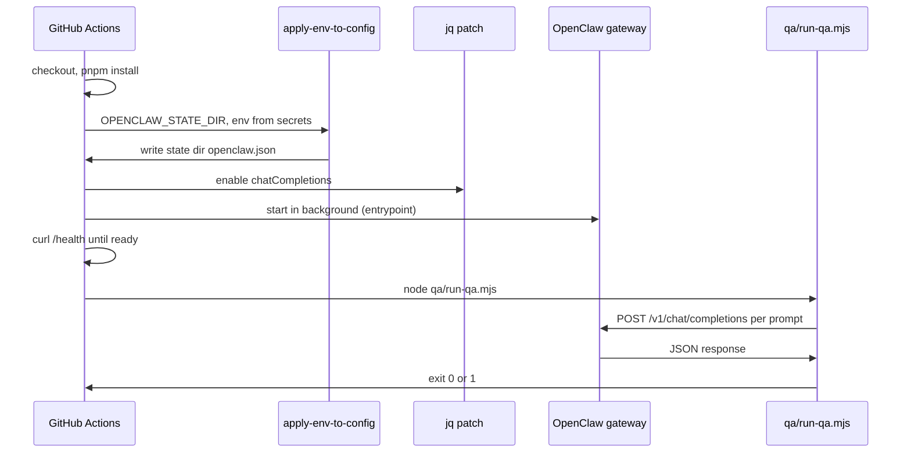

# GitHub Agent QA workflow and test runner

## Scope

- **Workflow**: `.github/workflows/agent-qa.yml` — on `push` / `pull_request`; install deps, apply config, start gateway, run QA.
- **Test runner**: Node script `qa/run-qa.mjs` — reads `qa/prompts.json`, POSTs each prompt to the gateway, asserts on response content.
- **Prompts config**: `qa/prompts.json` — JSON array of `{ id, prompt, expectPattern?, expectNotPattern?, user? }`.

No changes to core OpenClaw or convos extension code.

---

## 1. Chat Completions endpoint (required for QA)

The OpenAI-compatible `/v1/chat/completions` API is **disabled by default** in OpenClaw. It must be enabled for the workflow to work.

- **Approach**: In the workflow, after running `apply-env-to-config.sh`, patch the generated config with `jq` to set `gateway.http.endpoints.chatCompletions.enabled: true` before starting the gateway. This keeps [config/openclaw.json](config/openclaw.json) unchanged and enables the endpoint only in CI.

---

## 2. Workflow layout

**Steps:**

1. **Checkout** — `actions/checkout@v4`.
2. **Node + pnpm** — `actions/setup-node` with pnpm (repo uses `packageManager: pnpm` in [package.json](package.json)); then `pnpm install` so `openclaw` and `agentmail` (and extensions) are available.
3. **Env** — Set from GitHub secrets/vars:
  - `OPENCLAW_GATEWAY_TOKEN` from secret `OPENCLAW_TOKEN` (repo uses it in [cli/scripts/entrypoint.sh](cli/scripts/entrypoint.sh)).
  - `OPENCLAW_PRIMARY_MODEL` from var (e.g. `openrouter/openai/gpt-5.1-codex-mini`).
  - `AGENTMAIL_API_KEY` from secrets (referenced in [config/openclaw.json](config/openclaw.json)).
  - Optional for future: `SMOOTH_BROWSER_API_KEY`, `BANKR_API_KEY` if you add them — can be empty in CI if not used.
4. **Config** — Set `OPENCLAW_STATE_DIR` to a runner temp dir (e.g. `$RUNNER_TEMP/openclaw` or `./.openclaw-ci`) so CI doesn’t touch `~/.openclaw`. Run `pnpm cli apply` (uses `OPENCLAW_STATE_DIR` and writes `$OPENCLAW_STATE_DIR/openclaw.json`). Then patch that file with jq to set `gateway.http.endpoints.chatCompletions.enabled = true`.
5. **Start gateway** — Run `pnpm cli start` in the background (or `node cli/index.cjs start`; reads `OPENCLAW_CONFIG_PATH` / `OPENCLAW_STATE_DIR`). Wait for readiness with a loop: `curl -sf http://127.0.0.1:18789/health` (or the port from config) until success or timeout (e.g. 60s).
6. **Run QA** — `node qa/run-qa.mjs` (or `pnpm exec node qa/run-qa.mjs`). Runner reads `BASE_URL` (default `http://127.0.0.1:18789`) and `OPENCLAW_GATEWAY_TOKEN` from env.

**Agent id**: Config uses default agent id `main-agent` ([config/openclaw.json](config/openclaw.json)). The API may accept `openclaw:main` for the default agent; if not, the test runner and/or workflow should use `openclaw:main-agent` (or a runner env var `OPENCLAW_AGENT_ID=main-agent`).

---

## 3. Test runner (`qa/run-qa.mjs`)

- **Input**: `qa/prompts.json` — array of objects:
  - `id` (string): test id for logs.
  - `prompt` (string): user message.
  - `expectPattern` (string, optional): regex or substring; response content must match (case-insensitive).
  - `expectNotPattern` (string, optional): response must not match.
  - `user` (string, optional): session id for multi-turn (e.g. `qa-session-001`).
- **Behavior**:
  - For each entry, POST to `BASE_URL/v1/chat/completions` with:
    - `Authorization: Bearer $OPENCLAW_GATEWAY_TOKEN`
    - `Content-Type: application/json`
    - Optional header `x-openclaw-agent-id: main-agent` (or from env).
    - Body: `{ model: "openclaw:main-agent", user?: "<user>", messages: [{ role: "user", content: "<prompt>" }] }`.
  - Parse JSON; read `choices[0].message.content`; if missing or error, fail that test.
  - If `expectPattern` is set, assert content matches (e.g. `content.toLowerCase().includes(expectPattern.toLowerCase())` or regex).
  - If `expectNotPattern` is set, assert content does not match.
  - Log pass/fail per id; exit code 1 on first failure, 0 if all pass.
- **Env**: `BASE_URL` (default `http://127.0.0.1:18789`), `OPENCLAW_GATEWAY_TOKEN`, optional `OPENCLAW_AGENT_ID` (default `main-agent`).
- **Dependencies**: Node built-ins only (`fetch`, `fs`, `process`); no extra npm packages.

---

## 4. `qa/prompts.json` (initial contents)

Seed with two prompts aligned to your example:

- **browser** — `"Browse to https://example.com and tell me the page title"` with `expectPattern: "example"` and a dedicated `user` (e.g. `qa-session-browse-001`).
- **email** — `"Check my inbox for recent emails"` with no `expectPattern` (assert only that `choices[0].message.content` exists and no API error).

This keeps the first run minimal; you can add more entries and optional `expectNotPattern` later.

---

## 5. Files to add

| Path                             | Purpose                                                                                                         |
| -------------------------------- | --------------------------------------------------------------------------------------------------------------- |
| `.github/workflows/agent-qa.yml` | Single job: checkout, pnpm install, apply config, jq-patch chatCompletions, start gateway, run `qa/run-qa.mjs`. |
| `qa/run-qa.mjs`                  | Node script: read prompts JSON, loop, POST, assert, exit code.                                                  |
| `qa/prompts.json`                | Initial list of prompt + expectPattern/user.                                                                    |

---

## 6. GitHub configuration

- **Secrets**: `OPENCLAW_TOKEN`, `AGENTMAIL_API_KEY` (and optional `SMOOTH_BROWSER_API_KEY`, `BANKR_API_KEY`).
- **Variables**: `OPENCLAW_PRIMARY_MODEL` (e.g. `openrouter/openai/gpt-5.1-codex-mini`). Optionally `OPENROUTER_API_KEY` or rely on OpenRouter key from another source if needed by the model.

---

## 7. Optional: allow-unconfigured

Your example used `--allow-unconfigured`. OpenClaw’s current CLI may or may not support that flag; the plan uses the repo’s existing entrypoint so the gateway starts with the same config and plugin path as local/dev. If the gateway refuses to start in CI due to missing channel/credentials, we can add a minimal “CI mode” (e.g. env var that relaxes strict checks) in a follow-up; no such change in this scaffold.

---

## 8. Summary

- One workflow file, one runner script, one prompts file.
- Config is generated and patched in CI; chat completions enabled only for that run.
- Test runner is Node-only, no new dependencies; easy to extend with more prompts and assertion types later.

