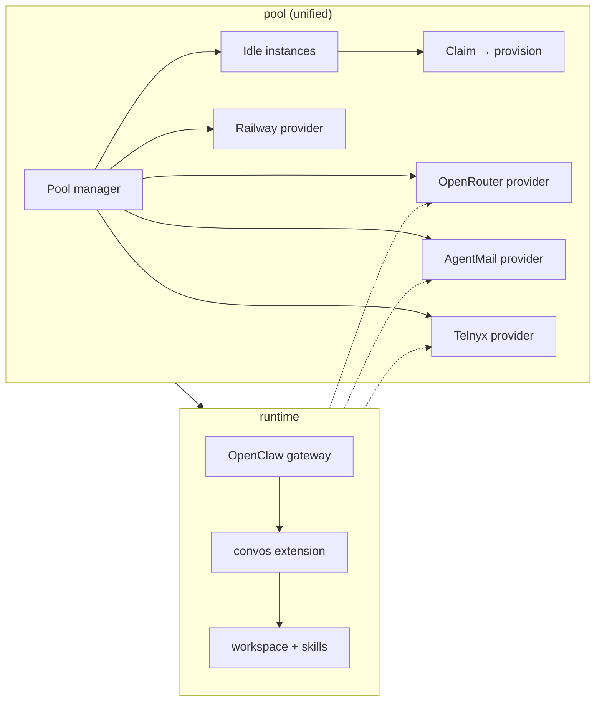

# Convos agents

OpenClaw gateway + Convos (XMTP) channel plugin. Pre-warmed agent instances are provisioned via a pool; users claim an agent and it's live in seconds.

See `docs/` for architecture, QA, changelog, and workarounds.

## Repo structure

```
convos-agents/
├── runtime/       # Agent runtime image (OpenClaw + config + extensions + skills)
├── pool/          # Pool manager + provider services (Express API + Postgres)
├── dashboard/     # Template site — Next.js app at assistants.convos.org
└── docs/          # Schema, QA, changelog, convos extension docs
```

## Architecture



## Components

### Runtime (`runtime/`)

The agent runtime image — OpenClaw gateway with the convos channel extension, workspace, and skills. Each agent instance runs as a container on Railway.

See [`runtime/README.md`](runtime/README.md) for scripts, environment variables, Docker setup, and CI.

### Convos Extension (`runtime/openclaw/extensions/convos/`)

Channel extension that connects OpenClaw agents to Convos conversations. Bundled inside the runtime image.

### Skills (`runtime/openclaw/workspace/skills/`)

Agent capabilities exposed as OpenClaw skills:

- **agentmail** — email (calendar invites, transactional email)
- **bankr** — crypto payments
- **convos-cli** — Convos client operations
- **telnyx-cli** — SMS messaging

### Pool (`pool/`)

Unified service that manages pre-warmed instances and all provider interactions (Railway, OpenRouter, AgentMail, Telnyx). Single process, single Postgres database.

See [`pool/README.md`](pool/README.md) for API, commands, configuration, database schema, and environments.

### Dashboard (`dashboard/`)

Next.js app at `assistants.convos.org`. Browse agent catalog, launch or join agents, template detail pages with OG images and QR codes.

See [`dashboard/README.md`](dashboard/README.md) for setup, routes, and deployment.

## Joining a conversation

Claim an idle instance via the pool API or the dashboard site:

**Via API** — `POST /api/pool/claim` (requires `POOL_API_KEY` in the `x-api-key` header)

```json
{
  "agentName": "tokyo-trip-planner",
  "instructions": "You are a helpful trip planner for Tokyo.",
  "joinUrl": "https://dev.convos.org/v2?i=..."
}
```

- Omit `joinUrl` to create a new conversation; include it to join an existing one.
- Returns an `inviteUrl` to share with users (QR code / deep link).

**Via dashboard** — visit `assistants.convos.org`, pick a template, and click Launch.

## Providers

| Provider | Role |
|----------|------|
| **OpenRouter** | LLM models + search. Per-agent keys with spending caps. |
| **Railway** | Compute. Each agent runs as a container. |
| **Agentmail** | Email. Per-agent inbox for calendar invites and transactional email. |
| **Telnyx** | SMS. Per-agent US number and messaging profile. |
| **Bankr** | Crypto payments. Per-agent wallet. |
