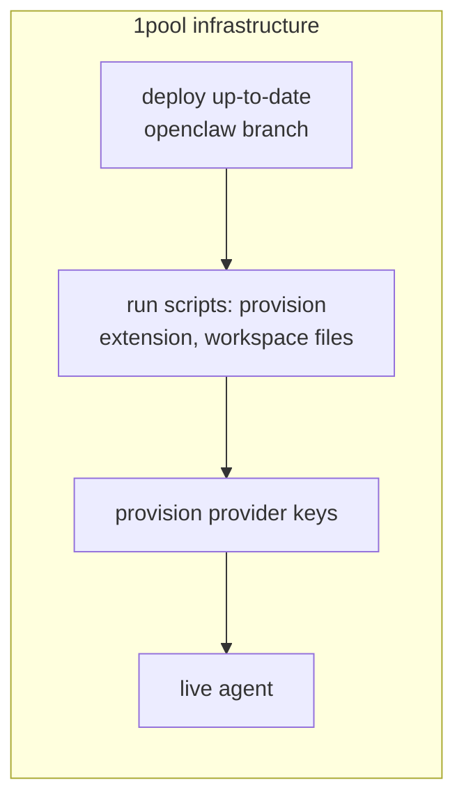

# convos-managed-agent-runtime

OpenClaw gateway + Convos (XMTP) channel plugin. Single agent, managed config.




Each `openclaw/` subdir syncs into `~/.openclaw/` (or `OPENCLAW_STATE_DIR`) at apply time:

| Path | Contents |
|------|----------|
| `openclaw/workspace` | AGENTS.md, SOUL.md, TOOLS.md, IDENTITY.md, HEARTBEAT.md, BOOT.md, USER.md, form/, skills/ (agentmail) |
| `openclaw/extensions` | convos (XMTP), web-tools (form at /web-tools/form) |
| `openclaw/openclaw.json` | Config template (env-substituted → `~/.openclaw/openclaw.json`) |
| `cli/` | apply-config, gateway, install-state-deps scripts |

## Repo structure

```
.
├── cli/
│   ├── index.cjs              # CLI entry (key-provision, apply-config, gateway, start)
│   ├── run.cjs, check-paths.cjs, context.cjs
│   └── scripts/
│       ├── apply-config.sh    # Sync openclaw/ → state dir, copy config
│       ├── gateway.sh         # Start OpenClaw gateway
│       ├── install-state-deps.sh
│       ├── keys.sh            # key-provision
│       ├── openrouter-ensure-key.sh
│       └── lib/               # init, env-load, sync-openclaw, config-inject-extensions
├── openclaw/
│   ├── openclaw.json          # Config template (env vars substituted at load)
│   ├── workspace/             # → ~/.openclaw/workspace
│   │   ├── AGENTS.md, SOUL.md, TOOLS.md, IDENTITY.md, HEARTBEAT.md, BOOT.md, USER.md
│   │   ├── memory/
│   │   ├── form/              # form.html (served at /web-tools/form)
│   │   └── skills/            # agentmail (SKILL.md, scripts/*.mjs)
│   ├── extensions/
│   │   ├── convos/            # XMTP channel plugin (landing at /convos/landing)
│   │   │   ├── landing/       # landing.html, sw.js, manifest, icon
│   │   │   ├── index.ts, openclaw.plugin.json, package.json
│   │   │   └── src/
│   │   └── web-tools/         # workspace-based web tools (form at /web-tools/form)
│   │       └── index.ts, openclaw.plugin.json, package.json
├── package.json, pnpm-lock.yaml
├── Dockerfile, railway.toml
├── .env.example
└── README.md, CHANGELOG.md, CLAUDE.md
```

## Environment

Copy `.env.example` to `.env` and fill in values. Required for gateway + agentmail:

```
# Default model for agent (provider/model)
OPENCLAW_PRIMARY_MODEL=openrouter/openai/gpt-5.1-codex-mini
# Optional; OpenRouter management API
OPENROUTER_MANAGEMENT_KEY=

# Gateway auth (CLI, Control UI); key-provision can generate
OPENCLAW_GATEWAY_TOKEN=
# Optional; setup wizard password
SETUP_PASSWORD=
# OpenRouter API key (model auth)
OPENROUTER_API_KEY=

# XMTP network: dev or production
XMTP_ENV=dev
# AgentMail: send email, calendar invites, poll inbox
AGENTMAIL_API_KEY=
AGENTMAIL_INBOX_ID=

# XMTP/Convos wallet; key-provision can generate
WALLET_KEY=
# State dir (default ~/.openclaw); Docker sets /app
OPENCLAW_STATE_DIR=
```


## Usage

```bash
pnpm run key-provision      # Generate keys, write .env
pnpm run apply-config       # Sync openclaw/ → state dir, apply .env to config
pnpm run install-state-deps # Install extension/skill deps
pnpm run gateway            # Start the gateway
pnpm start                  # apply-config + install-state-deps + gateway
```

## Flow

1. **apply-config** — Syncs `openclaw/workspace` (includes skills), `extensions` into `OPENCLAW_STATE_DIR`, copies config template. When `OPENCLAW_STATE_DIR` or `PORT` is set (Docker/Railway), patches gateway port/bind and `agents.defaults.workspace` so web-tools form resolves correctly.
2. **gateway** — Runs OpenClaw with `OPENCLAW_CONFIG_PATH` and injected plugin paths

No core OpenClaw changes. Convos lives entirely in the plugin.
