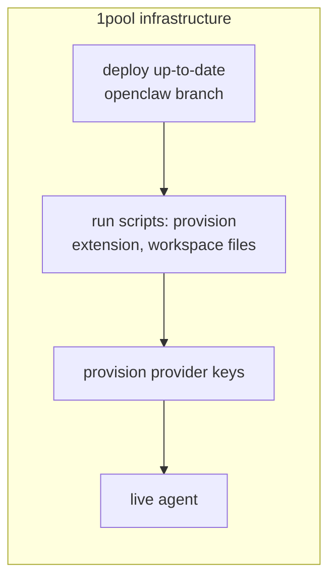

# convos-managed-agent-runtime

OpenClaw gateway + Convos (XMTP) channel plugin. Single agent, managed config.

## Stack

- **OpenClaw** — gateway, agents, sessions, tools
- **Convos extension** — XMTP channel plugin (DMs, groups)

## Architecture

**Convos extension** — Plugin that registers the XMTP channel with OpenClaw. Handles DMs and groups, message send/receive, and session routing. Lives under `openclaw/extensions/convos`; synced into `~/.openclaw/extensions` at apply time. No core OpenClaw changes.

**Agentmail skill** — Skill that teaches the agent to send email and calendar invites (and poll inbox) via AgentMail scripts. Requires `AGENTMAIL_API_KEY` and `AGENTMAIL_INBOX_ID`. Scripts live in the skill dir; agent invokes them with `exec` (e.g. `send-email.mjs`, `poll-inbox.mjs`).

**Browser automation** — OpenClaw’s built-in browser tool. Locally, config can set `browser.executablePath` (e.g. Chrome). In Docker/Railway, image sets `CHROMIUM_PATH` and installs Chromium + deps; use `target: "host"` and pass `targetUrl` for headless. Workspace TOOLS.md guides when to use browser vs web_search vs agentmail.

**Positioning workflow (1pool)** — Infra deploys a current OpenClaw branch, runs provisioning scripts (extensions, workspace files, provider keys), then runs the live agent. Mermaid below.



1pool infrastructure (positioning workflow):

1. **Deploy** — Up-to-date branch of OpenClaw (e.g. npm `openclaw` or build from repo).
2. **Provision** — Scripts sync extension(s), workspace files, skills, landing into state dir; apply-config writes config from template + env.
3. **Keys** — key-provision (or env) sets gateway token, wallet, OpenRouter/AgentMail/etc. keys.
4. **Live agent** — Gateway starts; Convos connects XMTP; agent runs with full tools (browser, agentmail, web_search, etc.).

## Layout

Each `openclaw/` subdir syncs into `~/.openclaw/` (or `OPENCLAW_STATE_DIR`) at apply time:

| Path | Contents |
|------|----------|
| `openclaw/workspace` | AGENTS.md, SOUL.md, TOOLS.md, IDENTITY.md, HEARTBEAT.md, BOOT.md, USER.md |
| `openclaw/skills` | agentmail (email skill) |
| `openclaw/extensions` | convos (XMTP channel plugin) |
| `openclaw/landing` | landing.html, form.html, sw.js, manifest, icon |
| `openclaw/openclaw.json` | Config template (env-substituted → `~/.openclaw/openclaw.json`) |
| `cli/` | apply-config, gateway, install-state-deps scripts |

## Repo structure

```
.
├── cli/
│   ├── index.cjs              # CLI entry (key-provision, apply-config, gateway, start)
│   ├── run.cjs, check-paths.cjs, context.cjs
│   └── scripts/
│       ├── apply-config.sh    # Sync openclaw/ → state dir, copy config
│       ├── gateway.sh         # Start OpenClaw gateway
│       ├── install-state-deps.sh
│       ├── keys.sh            # key-provision
│       ├── openrouter-ensure-key.sh
│       └── lib/               # init, env-load, sync-openclaw, config-inject-extensions
├── openclaw/
│   ├── openclaw.json          # Config template (env vars substituted at load)
│   ├── workspace/             # → ~/.openclaw/workspace
│   │   ├── AGENTS.md, SOUL.md, TOOLS.md, IDENTITY.md, HEARTBEAT.md, BOOT.md, USER.md
│   │   └── memory/
│   ├── skills/
│   │   └── agentmail/         # SKILL.md, scripts/*.mjs, references/
│   ├── extensions/
│   │   └── convos/            # XMTP channel plugin
│   │       ├── index.ts, openclaw.plugin.json, package.json
│   │       └── src/           # channel, accounts, actions, sdk-client, outbound, …
│   └── landing/               # landing.html, form.html, sw.js, manifest, icon
├── package.json, pnpm-lock.yaml
├── Dockerfile, railway.toml
├── .env.example
└── README.md, CHANGELOG.md, CLAUDE.md
```

## Usage

```bash
pnpm run key-provision      # Generate keys, write .env
pnpm run apply-config       # Sync openclaw/ → state dir, apply .env to config
pnpm run install-state-deps # Install extension/skill deps
pnpm run gateway            # Start the gateway
pnpm start                  # apply-config + gateway
```

## Flow

1. **apply-config** — Syncs `openclaw/workspace`, `skills`, `extensions`, `landing` into `OPENCLAW_STATE_DIR`, substitutes `.env` into `openclaw.json`
2. **gateway** — Runs OpenClaw with `OPENCLAW_CONFIG_PATH` and injected plugin paths

No core OpenClaw changes. Convos lives entirely in the plugin.
