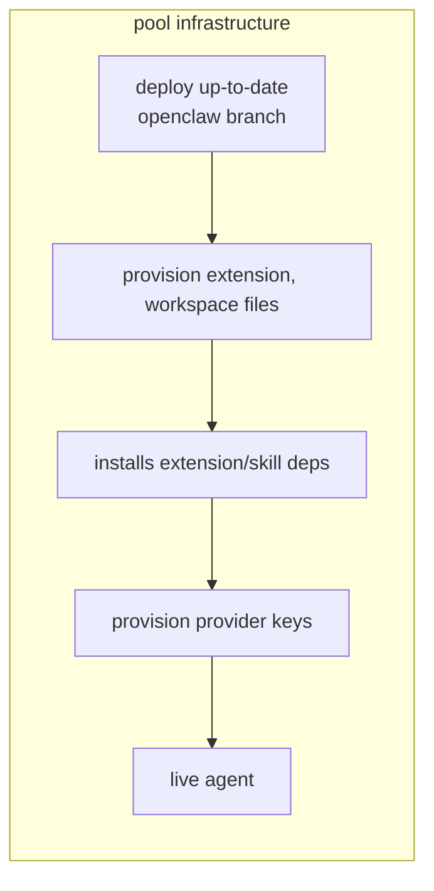

# convos-managed-agent-runtime

OpenClaw gateway + Convos (XMTP) channel plugin. Single agent, managed config.

See `docs/` for design, QA, changelog, pool, and workarounds.



## OpenClaw

The `openclaw/` directory is synced into `~/.openclaw/` (or `OPENCLAW_STATE_DIR`) when you run `pnpm cli apply` (or as part of `pnpm cli init`):

**File provisioning structure:**

```jsx
├── openclaw/
│   ├── openclaw.json          # Config template (env vars substituted at load)
│   ├── workspace/             # → ~/.openclaw/workspace (or $OPENCLAW_STATE_DIR/workspace)
│   │   ├── AGENTS.md, SOUL.md, TOOLS.md, IDENTITY.md, HEARTBEAT.md, BOOT.md, USER.md
│   │   └── skills/
│   │       ├── agentmail/     # SKILL.md, scripts
│   │       └── telnyx-cli/    # SKILL.md, config, setup, test
│   │       └── bankr/         # SKILL.md, config, setup, test
│   └── extensions/
│       ├── convos/            # XMTP channel plugin (/convos/join, /convos/conversation, setup)
│       │   ├── index.ts, openclaw.plugin.json, package.json
│       │   └── src/           # channel, accounts, sdk-client, outbound, …
│       └── web-tools/         # form at /web-tools/form, agents at /web-tools/agents
│           ├── form/          # form.html
│           ├── agents/        # landing.html, sw.js, manifest, icon (calls convos APIs)
│           └── index.ts, openclaw.plugin.json, package.json
```

### Environment

Copy `.env.example` to `.env` and fill in the API keys you have. Everything else is auto-provisioned when you run `pnpm cli key-provision`:

```md
# Default model for agent (provider/model)
OPENCLAW_PRIMARY_MODEL=openrouter/openai/gpt-5.1-codex-mini

# --- You provide these ---

# OpenRouter: model auth (provide key directly, OR management key to auto-create)
OPENROUTER_API_KEY=
OPENROUTER_MANAGEMENT_KEY=

# XMTP network: dev or production
XMTP_ENV=dev

# AgentMail: email for agents (inbox auto-provisioned)
AGENTMAIL_API_KEY=

# Bankr: crypto payments
BANKR_API_KEY=

# Telnyx: SMS phone numbers (number auto-provisioned)
TELNYX_API_KEY=

# State dir: root for config, workspace, extensions, credentials, sessions. Default ~/.openclaw. Docker sets /app.
OPENCLAW_STATE_DIR=
# Path to Chrome/Chromium for browser tool. 
# Docker sets /usr/bin/chromium. macOS: leave unset (template uses /Applications/Google Chrome.app). Linux local: set /usr/bin/chromium.
CHROMIUM_PATH=

# --- Auto-provisioned by key-provision (leave empty) ---
OPENCLAW_GATEWAY_TOKEN=
SETUP_PASSWORD=
AGENTMAIL_INBOX_ID=
TELNYX_PHONE_NUMBER=
TELNYX_MESSAGING_PROFILE_ID=
```

POOL_API_KEY and SETUP_PASSWORD (for pool/convos auth) are optional; when unset, pool and convos HTTP endpoints allow unauthenticated access.

## CLI

Run with: `pnpm cli <command>`. Help: `pnpm cli help`.

| Command | Description |
|---------|-------------|
| `check` | Log root, workspace, state dir, config and openclaw paths |
| `key-provision` | Generate OPENCLAW_GATEWAY_TOKEN, SETUP_PASSWORD, WALLET_PRIVATE_KEY; create or reuse OpenRouter key and write .env |
| `apply` | Sync workspace/skills/extensions and copy config template to state dir |
| `install-deps` | Install extension and skill deps in OPENCLAW_STATE_DIR |
| `gateway run` | Start the gateway |
| `init` | Provision keys (if missing), apply, install-deps, then start the gateway |
| `reset <target>` | Reset state. Target: `sessions` (clear session state), `chrome` (restart browser) |
| `qa [suite]` | Run QA smoke test. Suites: email, sms, bankr, search, browser, all (default) |

**Quick start:** `pnpm cli init`. First time: copy `.env.example` to `.env` and set any keys you have.
