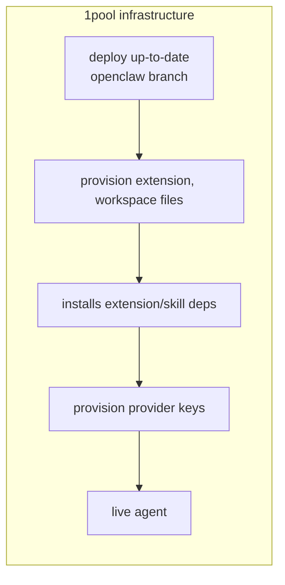

# convos-managed-agent-runtime

OpenClaw gateway + Convos (XMTP) channel plugin. Single agent, managed config.




Each `openclaw/` subdir syncs into `~/.openclaw/` (or `OPENCLAW_STATE_DIR`) at apply time:

## Repo structure

```
.
├── cli/
│   ├── index.cjs              # CLI entry (key-provision, apply-config, gateway, start)
│   ├── run.cjs, check-paths.cjs, context.cjs
│   └── scripts/
│       ├── apply-config.sh    # Sync openclaw/ → state dir, copy config
│       ├── gateway.sh         # Start OpenClaw gateway
│       ├── install-state-deps.sh
│       ├── keys.sh            # key-provision
│       ├── openrouter-ensure-key.sh
│       └── lib/               # init, env-load, sync-openclaw, config-inject-extensions
├── openclaw/
│   ├── openclaw.json          # Config template (env vars substituted at load)
│   ├── workspace/             # → ~/.openclaw/workspace
│   │   ├── AGENTS.md, SOUL.md, TOOLS.md, IDENTITY.md, HEARTBEAT.md, BOOT.md, BOOTSTRAP.md, MEMORY.md, USER.md
│   │   └── skills/            # agentmail, telnyx-cli, bankr
│   ├── extensions/
│   │   ├── convos/            # XMTP channel plugin (/convos/join, /convos/invite, setup)
│   │   │   ├── index.ts, openclaw.plugin.json, package.json
│   │   │   └── src/
│   │   └── web-tools/         # form at /web-tools/form, agents at /web-tools/agents
│   │       ├── form/          # form.html
│   │       ├── agents/        # landing.html, sw.js, manifest, icon (calls convos APIs for join/invite)
│   │       └── index.ts, openclaw.plugin.json, package.json
├── package.json, pnpm-lock.yaml
├── Dockerfile, railway.toml
├── .env.example
└── README.md, CHANGELOG.md, CLAUDE.md
```

## Environment

Copy `.env.example` to `.env` and fill in the API keys you have. Everything else is auto-provisioned by `key-provision`:

```
# Default model for agent (provider/model)
OPENCLAW_PRIMARY_MODEL=openrouter/openai/gpt-5.1-codex-mini
# Optional; OpenRouter management API (creates OPENROUTER_API_KEY automatically)
OPENROUTER_MANAGEMENT_KEY=
# Or provide an OpenRouter key directly
OPENROUTER_API_KEY=

# XMTP network: dev or production
XMTP_ENV=dev

# AgentMail: email for agents (AGENTMAIL_INBOX_ID auto-provisioned)
AGENTMAIL_API_KEY=

# Bankr: crypto payments
BANKR_API_KEY=

# Telnyx: SMS phone numbers (TELNYX_PHONE_NUMBER auto-provisioned)
TELNYX_API_KEY=

# State dir (default ~/.openclaw); Docker sets /app
OPENCLAW_STATE_DIR=
```

Auto-provisioned by `key-provision` (skipped if already set):
- `OPENCLAW_GATEWAY_TOKEN`, `SETUP_PASSWORD`, `PRIVATE_WALLET_KEY` — random secrets
- `OPENROUTER_API_KEY` — created via management key if not set directly
- `AGENTMAIL_INBOX_ID` — unique inbox like `convos-<hex>@agentmail.to`
- `TELNYX_PHONE_NUMBER`, `TELNYX_MESSAGING_PROFILE_ID` — US SMS number purchased via Telnyx API


## Usage

```bash
pnpm run key-provision      # Provision keys, inboxes, phone numbers → .env (idempotent)
pnpm run apply-config       # Sync openclaw/ → state dir, apply .env to config
pnpm run install-state-deps # Install extension/skill deps (agentmail, telnyx-cli)
pnpm run gateway            # Start the gateway
pnpm start                  # key-provision + apply-config + install-state-deps + gateway
```
