## Overview

The goal: when a user claims an agent, it just works. Every skill pre-configured, every service connected, zero setup. The user sends a message and things happen.

---

## Architecture

### Provisioning Pool Architecture

Pre-warmed agent instances, ready for instant claim. Three repos, one flow.

```mermaid
flowchart TD
    A[Pool manager replenishes idle pool] --> B[Railway deploys container]
    B --> C[Container builds openclaw, boots gateway, creates XMTP identity]
    C --> D[Instance reports idle to pool manager]
    D --> E[User claims agent]
    E --> F[Pool manager calls POST /pool/provision]
    F --> G[Instance creates/joins conversation, writes INSTRUCTIONS.md]
    G --> H[Agent introduces itself — live and ready]
```



File provisioning structure

```jsx
├── openclaw/
│   ├── openclaw.json          # Config template (env vars substituted at load)
│   ├── workspace/             # → ~/.openclaw/workspace (or $OPENCLAW_STATE_DIR/workspace)
│   │   ├── AGENTS.md, SOUL.md, TOOLS.md, IDENTITY.md, HEARTBEAT.md, BOOT.md, USER.md
│   │   └── skills/
│   │       ├── agentmail/     # SKILL.md, scripts
│   │       └── telnyx-cli/    # SKILL.md, config, setup, test
│   │       └── bankr/         # SKILL.md, config, setup, test
│   └── extensions/
│       ├── convos/            # XMTP channel plugin (/convos/join, /convos/conversation, setup)
│       │   ├── index.ts, openclaw.plugin.json, package.json
│       │   └── src/           # channel, accounts, sdk-client, outbound, …
│       └── web-tools/         # form at /web-tools/form, agents at /web-tools/agents
│           ├── form/          # form.html
│           ├── agents/        # landing.html, sw.js, manifest, icon (calls convos APIs)
│           └── index.ts, openclaw.plugin.json, package.json
```

At deploy (Docker/Railway): `pnpm cli apply` patches `agents.defaults.workspace` to `$STATE_DIR/workspace` when `OPENCLAW_STATE_DIR` is set so web-tools and skills resolve correctly.

**How it works:**

- The **pool manager** (Express + Railway Postgres) maintains a pool of pre-warmed Railway containers. Delegates all provider interactions (Railway, OpenRouter, AgentMail, Telnyx) to the **services API**. A unified tick loop (every 30s) reconciles instance state via the services batch status endpoint, health-checks, and replenishes. Pool state (identity + claims) is in a Postgres `instances` table with atomic claiming; infra details live in the services DB.
- Each **container** (railway template) builds openclaw from source, runs it as an internal gateway on `127.0.0.1:18789`, and reverse-proxies through Express on port 8080. On boot it creates an XMTP identity, then waits for a provision call.
- On **claim**, the pool manager picks an idle instance and calls `POST /pool/provision` with `{ instructions, name?, joinUrl? }`. The instance creates or joins a conversation, writes `INSTRUCTIONS.md`, and is immediately live.

**Pool manager API:**

| Endpoint | Auth | Purpose |
| --- | --- | --- |
| `GET /api/pool/counts` | None | Idle/provisioning/claimed counts |
| `POST /api/pool/claim` | Bearer | Claim idle instance, provision with instructions |
| `POST /api/pool/replenish` | Bearer | Manually add N instances |
| `POST /api/pool/drain` | Bearer | Delete N idle instances |
| `POST /api/pool/reconcile` | Bearer | Sync DB with Railway |

**Two environments** (same Railway project, separate environments):

|  | Staging | Production |
| --- | --- | --- |
| Pool manager | `convos-agents-dev.up.railway.app` | `convos-agents.up.railway.app` |
| XMTP network | `dev` | `production` |
| Template branch | `staging` | `main` |

**Updating code:** Push to the relevant repo's staging branch, bump `OPENCLAW_CACHE_BUST` in the Dockerfile if openclaw changed, drain the pool, wait for new instances. Promote to production by repeating on `main`.

---

### Convos Architecture

Convos is a privacy-focused messaging app built on XMTP with a **per-conversation identity model**: each conversation gets its own XMTP inbox, private keys, and database. No single user identity exists across conversations.

**Core design decisions:**

- **Per-conversation identity** (ADR 002): One XMTP inbox = one conversation. Private keys stored in iOS Keychain with device-only access. A separate `clientId` (random UUID) is used for push notification routing so the backend never sees actual inbox IDs.
- **Decentralized invites** (ADR 001): Signed cryptographic tokens (ChaCha20-Poly1305 encrypted conversation ID, secp256k1 ECDSA signature). No backend validates invites — the creator processes join requests via DM. Invite tags in XMTP metadata enable revocation.
- **Per-conversation profiles** (ADR 005): Profiles stored in XMTP group `appData` as compressed protobuf (8KB limit). No central profile server. Users can have different names/avatars per conversation. **Quickname** provides local-only profile presets for convenience without compromising privacy.
- **Inbox lifecycle management** (ADR 003): Max 20 awake inboxes at a time with LRU eviction. Pre-created inbox cache eliminates conversation creation latency (<100ms vs 1-3s). Swift actor isolation prevents data races.
- **Conversation locking** (Lock Convo): Super admins can lock a conversation by setting XMTP `addMemberPolicy` to `.deny`. Rotates the invite tag to invalidate all existing invites.
- **Conversation explosion** (ADR 004): Custom XMTP content type (`ExplodeSettings`) propagates deletion requests. Destroys messages, metadata, private keys, and local XMTP database. Per-conversation identity means destroying the inbox makes cryptographic recovery impossible.

**Key invariants:**

- No identity reuse across conversations
- No centralized server for profiles, invites, or deletion
- XMTP's MLS provides E2EE for all messages and group metadata
- All destructive actions (lock, explode) are super-admin-only

---

## Skills

### How skills execute


### Skills list

Here's the current skills table:

| Skill | What it does | Provider | Visible to Convos | Visible to Provider | Status |
| --- | --- | --- | --- | --- | --- |
| **Web search** | General lookups, fact-checking, live info | Perplexity (via OpenRouter) | We see the cost of each call but not the content | Yes, model provider | ✅ |
| **Automation / browsing** | Navigate sites, check availability, fill forms | Local Chromium (per-instance) | No | Yes, model provider | ✅ |
| **Email** | Send ICS invites, transactional email | Agentmail | No | Yes, model provider (agentmail) | ✅ |
| **Scheduling** | Cron jobs, reminders, timed tasks | Internal (container-local) | No | No. Runs locally. | ✅ |
| **File handling** | Read/create PDFs, docs, spreadsheets | Internal (container-local) | No | No. Runs locally. | ❌ |
| **Image processing** | Analyze, resize, extract text from images | Internal (container-local) | No | Yes, model provider | ⏳ |
| **Voice & audio** | Transcription, TTS, voice notes | TBD | No | Yes, model provider | ❌ |
| **Payments** | Send, request, split bills | Bankr | No | Yes, Bankr API | ✅ |
| **SMS** | Send/receive SMS, manage phone numbers | Telnyx (telnyx-cli) | No | Yes, Telnyx API | ✅ |
| LLM call | Agents responses | Sonet, Claude? all via openrouter | We see the cost of each call but not the content |  |  |

### Convos channel extension

The agent is a first-class participant in Convos group chats. It uses the same messaging primitives as human members.

| Feature | What it does | Status |
| --- | --- | --- |
| **Markdown responses** | Sends formatted messages (bold, lists, links) via XMTP markdown content type. Renders natively in the app. | ⏳ |
| **Eyes for acknowledgement** | Reacts with 👀 when it reads a message but doesn't need to respond. Signals presence without cluttering the chat. | ⏳ |
| **Join existing conversations** | Can be added to any group via invite link. Joins, introduces itself, starts working. | ✅ |
| **Read attachments** | Receives and processes images, files, and other attachments. Users can share a menu screenshot, a PDF, or a photo. | ⏳ |
| **Answer only when prompted** | Doesn't reply to every message. Responds when directly addressed or when context makes it obvious it should act. Reads the room. | ⏳ |
| Users context | Get their quickname and more | ✅ |
| More app features | TBD |  |
| Explode | When a group explodes the agent and all of its files shoud be nuked. | ⏳ |
## Providers

### OpenRouter (models + search)

OpenRouter lets us manage AI consumption in a SaaS-like mode. Each agent gets its own API key on provision, with per-key spending limits and a dashboard to track usage across the fleet.


- **One key per agent.** Created on provision. Isolated billing
- **Spending caps.** Monthly limit per key. An agent can't exceed its cap. Credits are consumed only on use. We dont need to allocate. Curernt limit $20 per agent.
- **Many models, one account.** Claude for complex tasks, fast models for routing, Perplexity for search. One key covers everything. Suppeorted [model list](https://github.com/xmtplabs/convos-agents/blob/main/openclaw/openclaw.json)
- **Dashboard visibility.** Per-agent spend on a single dashboard. Which agents are active, expensive, or idle.
- **Path to charging users.** Free cap per agent. When exceeded, user tops up with crypto. OpenRouter is the metering layer.
- **Privacy**: we can't see the content of the conversations, just the api costs of each call.

### Railway (compute)

Each agent runs as a containerized Railway service with ephemeral filesystem, local Chromium, and scoped environment variables. Documented separately.

### Agentmail (email)

Each agent gets a unique scoped email address provisioned automatically via the AgentMail API. Inbox created during `pnpm cli key-provision` with username `convos-<hex>@agentmail.to`. Used for sending calendar invites, confirmations, and transactional email.

### Telnyx (SMS)

Each agent gets a US phone number purchased automatically via the Telnyx API during `pnpm cli key-provision`. A messaging profile with US whitelisted destinations is created, then a number is ordered and assigned. The agent uses the `telnyx-cli` skill (`@telnyx/api-cli`) to send/receive SMS.

### Bankr (crypto)

Per-agent crypto wallet for payments. API key provided manually (`BANKR_API_KEY`).

---

### Resources

https://github.com/xmtplabs/openclaw/pulls

https://github.com/xmtplabs/convos-agents

[v.01](https://www.notion.so/v-01-30730823ce928019a7cbf3b3bd519a4c?pvs=21)
