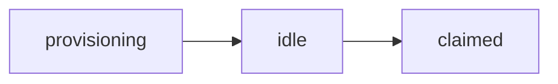

# Pool

Pool manager service — keeps pre-warmed OpenClaw instances on Railway. When a user claims an agent, the manager picks an idle instance and provisions it.

Pool delegates all provider interactions (Railway, OpenRouter, AgentMail, Telnyx) to the [services API](../services/README.md).

## Lifecycle



- **provisioning** → container building, gateway starting, XMTP identity created.
- **idle** → instance reports `ready` at `/convos/status`, available for claim.
- **claimed** → manager calls `/pool/provision` (or `/convos/conversation` / `/convos/join`), instance is bound to a conversation.

## Commands

From project root:

| Command | Description |
|--------|-------------|
| `pnpm pool` | Start pool server |
| `pnpm pool:dev` | Start with watch + `pool/.env` |
| `pnpm pool:db:migrate` | Run DB migrations |
| `pnpm pool:test` | Run pool tests |

Or from `pool/`:

| Command | Description |
|--------|-------------|
| `pnpm dev` | Start with watch + `.env` |
| `pnpm start` | Start server |
| `pnpm test` | Run tests |
| `pnpm db:migrate` | Run DB migrations |
| `pnpm db:enrich` | Backfill instance metadata from services API |

## Configuration

Copy `.env.example` to `.env`. Key vars:

```bash
# Pool
PORT=3001
POOL_API_KEY=your-shared-pool-secret
POOL_ENVIRONMENT=staging          # "staging" or "production"
POOL_MIN_IDLE=1
DATABASE_URL=postgresql://...

# Services API
SERVICES_URL=http://services.railway.internal:3002
SERVICES_API_KEY=your-services-secret

# Railway (for display/dashboard links only)
RAILWAY_PROJECT_ID=your-project-id
RAILWAY_ENVIRONMENT_ID=your-environment-id
```

## API

Authenticated with Bearer `POOL_API_KEY` unless noted.

| Endpoint | Method | Auth | Purpose |
|----------|--------|------|---------|
| `/healthz` | GET | No | Health check |
| `/version` | GET | No | Build version and environment |
| `/api/pool/counts` | GET | No | Idle / provisioning / claimed counts |
| `/api/pool/agents` | GET | No | List claimed and crashed agents |
| `/api/pool/claim` | POST | Yes | Claim idle instance, provision with instructions or `joinUrl` |
| `/api/pool/replenish` | POST | Yes | Add N instances |
| `/api/pool/drain` | POST | Yes | Remove N idle instances |
| `/api/pool/reconcile` | POST | Yes | Sync DB with Railway |
| `/api/pool/instances/:id` | DELETE | Yes | Kill a launched instance |
| `/api/pool/crashed/:id` | DELETE | Yes | Dismiss a crashed agent |

Dashboard UI is served at `/`.

## Environments

- **staging**: `convos-agents-dev.up.railway.app` (XMTP dev)
- **production**: `convos-agents.up.railway.app` (XMTP production)

See `docs/pool.md` for more details.
